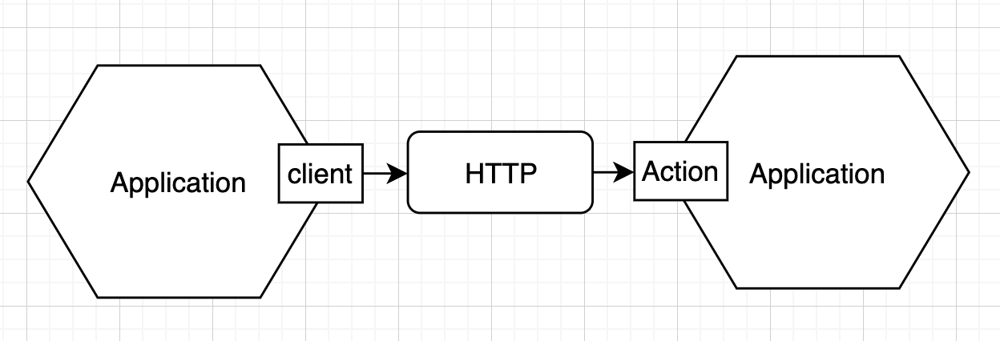
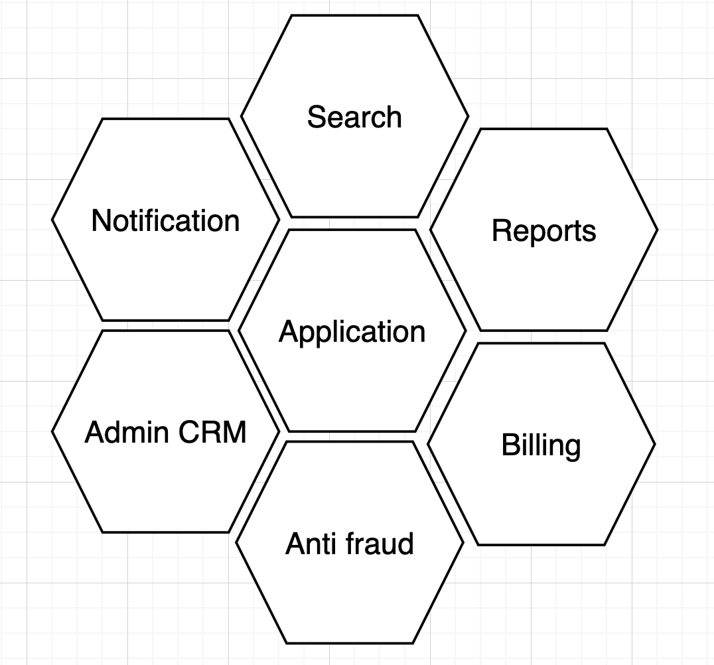

# [Architecture](README.md)

## Hexagonal Architecture
The main idea behind hexagonal architecture is to have clear segregation of logic via the interface segregation principle.
The Hexagonal Architecture, also known as Ports and Adapters. You can have multiple adapters for a single port or even a single adapter for multiple ports.
Once we dig deeper into the hexagonal architecture, we will find that it take a start from [Onion architecture](onion.md) another know like traditional layered architecture.
The hexagonal architecture is based on three principles and techniques:
* Separate User-Side, Business Logic, and Server-Side
* Dependencies are going from User-Side and Server-Side to the Business Logic
* Isolate the boundaries by using Ports and Adapters

**Port** - an interface between the system and the outside world that has been designed for a particular purpose or protocol. Good example would be [PHP Standards Recommendations](https://www.php-fig.org/psr/) - it is a set of PHP interfaces that describe common concepts that have already been tested and worked out.

**Adapter** - An adapter allows interaction through a particular port using a particular technology. Good example would be a third-party library (client). 

**Domain** - at the very core of the hexagonal architecture lies the domain model, implemented using the building blocks of tactical [DDD](ddd.md). This is where the so-called business logic lives, where all the business decisions are made.

**Application** - an application service acts as a facade through which clients interact with the domain model.

So far, we have only looked at what the hexagonal architecture looks like when applied to a single bounded context. But what happens when you have multiple bounded contexts that need to communicate with each other?
In this case mapping between the different contexts would take place in the downstream system’s adapter. Client and Action has act as ports and HTTP is an adapter between them.

The hexagonal architecture good scalable and suitable for implementing microservices. From a microservice’s perspective, all other microservices are parts of the outside world and are isolated via ports and adapters, just like the rest of the infrastructure.
There is no fixed size limit; 

### Primary and Secondary Ports and Adapters
From the example above, we have seen two types of ports and adapters – those that control the application (driving side) and those that are controlled by the application (driven side):
* Primary side: UI ports and adapters
* Secondary: Infrastructure ports and adapters

### When to apply
* When we need completely isolate your application logic and domain logic
* When we have many context and need to communicate with them

### How to implement
* Identify the Domain Model
* Define Ports
* Implement Adapters
* Use [DDD](ddd.md) tactical patterns
* Follow dependency inversion principle

### Summary
* We can test/deploy all components in complete isolation using test doubles
* Application is completely decoupled from the technology, we can upgrade and replace the infrastructure
* The core business logic is separated from any external dependencies, resulting in a high degree of decoupling
* Domain separating concerns between the core business logic, the application core deals exclusively with business topics
* Quickly make a change in your code without side effect

### Read
* [DDD, Hexagonal, Onion, Clean, CQRS, … How I put it all together](https://herbertograca.com/2017/11/16/explicit-architecture-01-ddd-hexagonal-onion-clean-cqrs-how-i-put-it-all-together/)
* [Domain Driven Hexagonal](https://i.stack.imgur.com/gPKrg.jpg)
* [Hexagonal Architecture: three principles and an implementation example](https://blog.octo.com/hexagonal-architecture-three-principles-and-an-implementation-example/)
* [Hexagonal Architecture, there are always two sides to every story](https://medium.com/ssense-tech/hexagonal-architecture-there-are-always-two-sides-to-every-story-bc0780ed7d9c)
* [Domain-Driven Design and the Hexagonal Architecture](https://vaadin.com/blog/ddd-part-3-domain-driven-design-and-the-hexagonal-architecture)
* [HEXAGONAL ARCHITECTURE - WHAT IS IT? WHY SHOULD YOU USE IT?](https://www.happycoders.eu/software-craftsmanship/hexagonal-architecture/)
* [What's Hexagonal Architecture?](https://medium.com/@luishrsoares/whats-hexagonal-architecture-6da22d4ab600)
* [Video - Hexagonal Architecture: What You Need To Know - Simple Explanation](https://www.youtube.com/watch?v=bDWApqAUjEI)