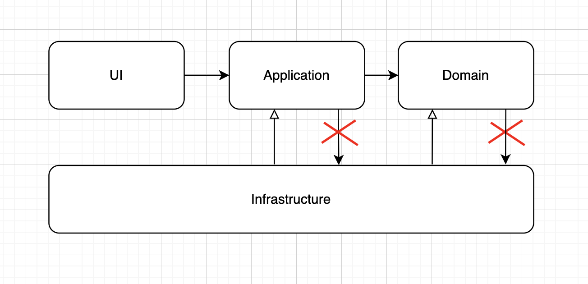

# [Architecture](README.md)

## Layered Architecture
The goal of traditional Layered Architectures is to segregate an application into different tiers, where each tier contains modules and classes that have shared or similar responsibilities, and work together to perform specific tasks.
As a result, our application will be divided into small, decoupled, components. Each of these components belongs to one of the 4 Major Layers:
* UI (Framework layer) - holds framework-specific configuration and allows leverages with the outside world
* Application layer - acts as a mediator for the Domain Layer: validating and mapping the data coming in
* Domain layer - is responsible for all the business logic
* Infrastructure layer - the majority of your application's external dependencies

### Rules
* The application is built around an independent object model
* Inner layers define interfaces. Outer layers implement interfaces
* Direction of coupling is toward the center
* All application core code can be compiled and run separate from infrastructure

### Separation of Concerns
* Independent of the framework
* Testable
* Independent of UI
* Independent of Database
* Independent of external agency

### When to apply
* Good structure code obviously important for everyone
* Good fit for microservices without too much serious business logic
* For Projects with no or few complex business scenario
* Projects with few dependencies on the infrastructure
* Multiple small projects handled by the same group of people, such as an internal architecture for microservices

### How to implement
* Divide applications into layers
* Follow dependency rules
* Follow dependency inversion principle [DIP](dip.md)

### Summary
The layered architecture pattern is a solid general-purpose pattern, making it a good starting point for most applications, particularly when you are not sure what architecture pattern is best suited for your application. However, there are a couple of things to consider from an architecture standpoint when choosing this pattern.

Well-separated domain layer helps you define your Presentation and Data layer as you wish. The concept is very easy to learn and visible in the project at first grasp
When you want to change something in some/all objects of a given kind, they’re very easy to find and they’re kept all together

### Tools
Keep your architecture clean help [Deptrac](https://qossmic.github.io/deptrac/) With it you can freely define your architectural layers over classes and which rules should apply to them.

### Read
* [The Clean Code Blog - The Clean Architecture](https://blog.cleancoder.com/uncle-bob/2012/08/13/the-clean-architecture.html)
* [Layered Architecture](https://herbertograca.com/2017/08/03/layered-architecture/)
* [The Onion Architecture (Part 1...4)](https://jeffreypalermo.com/2008/07/the-onion-architecture-part-1/)
* [oreilly - Chapter 1. Layered Architecture](https://www.oreilly.com/library/view/software-architecture-patterns/9781491971437/ch01.html)
* [4+2 Layered Architecture](https://medium.com/@nogueira.cc/4-2-layered-architecture-313329082989)
* [Book - Patterns of Enterprise Application Architecture ](https://www.amazon.com/-/en/dp/0321127420)
* [Video - Software Application N-tier (Layered) Architecture design pattern](https://www.youtube.com/watch?app=desktop&v=V4RDMV0L-JM)