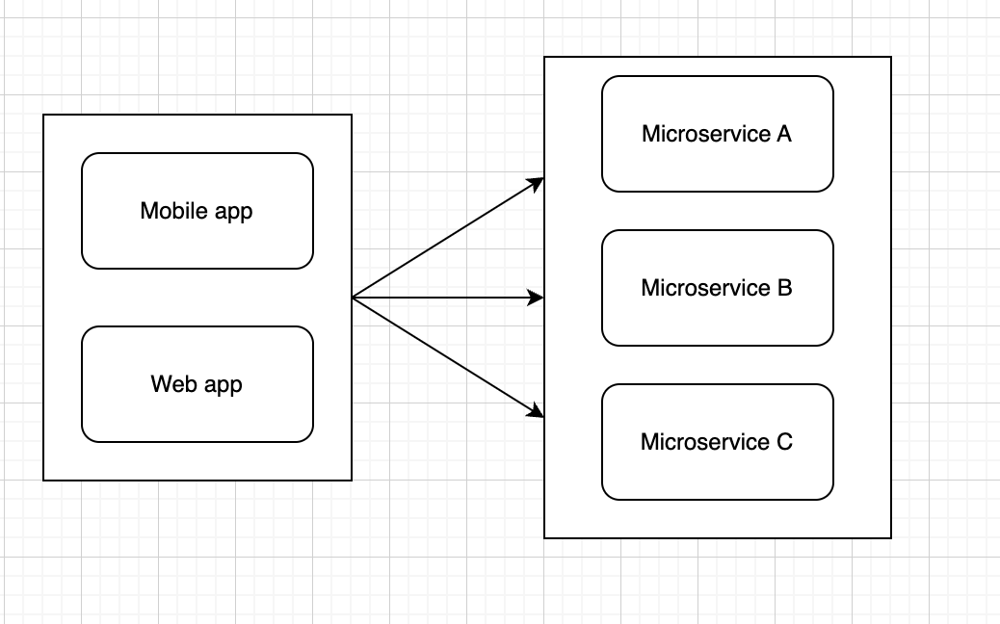
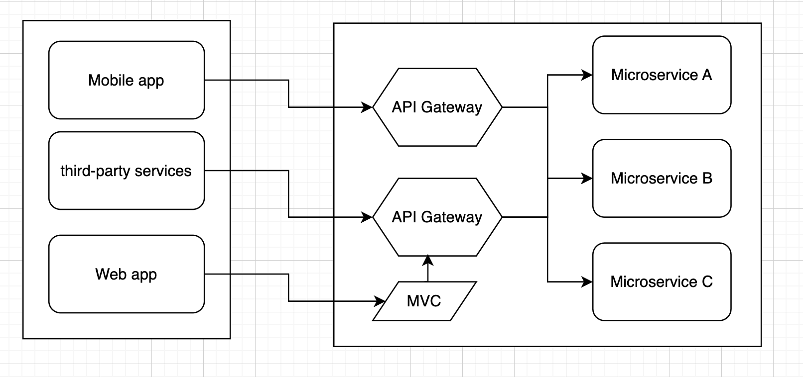

# [Architecture](README.md)

## Microservices Architecture
Encapsulate code with independent functionality that performs only one job(function) and has an interface for communication. Easy scalable because live in own docker container.

## Communication
* gRPC + Protobuf
* SOAP
* REST
* RabbitMQ/Kafka

## API Gateway

### Direct client to microservice communication

In this approach, each microservice has a public endpoint for communicate with web or mobile app.
For big application this approach has a row of feature problems:
* Interacting with multiple microservices to build a single UI screen increases the number of round trips across the Internet. This approach increases latency and complexity on the UI side. Ideally, responses should be efficiently aggregated in the server side
* Implementing security and cross-cutting concerns like security and authorization on every microservice can require significant development effort
* AMQP or binary protocols not friendly for clients, so we need to use only HTTP/HTTPS protocols
* Request/Response the needs of a mobile app might be different than the needs of a web app
* Coupled to the internal microservices
* Security issues. Have open IP address in the global web
* Functional duplicate. Example: authorization

### Client to gateway communication

When you design and build large or complex microservice-based applications with multiple client apps, a good approach to consider can be an API Gateway.
This pattern is a service that provides a single-entry point for certain groups of microservices. It's similar to the [Facade pattern](https://refactoring.guru/design-patterns/facade).
It acts as a reverse proxy, routing requests from clients to services. It can also provide other cross-cutting features such as authentication, SSL termination, logs, and cache.

That fact can be an important risk because your API Gateway service will be growing and evolving based on many different requirements from the client apps. Good practice is using separated gateways.

An API Gateway can offer multiple features, some of tham clouds give you from the box:
* Load balancing
* Gateway routing
* Requests aggregation
* Authentication and authorization
* Response caching
* Retry policies, circuit breaker, and QoS
* Rate limiting and throttling
* IP allowlisting

Deficiencies:
* Single point of failure
* Bottleneck
* Additional configuration work

### Summary
* Easy test, support, deploy, scale, create tasks
* Free choice of technologies
* Fast IDE up and work

### Read
* [Video - Microservices vs Monolithic Architecture](https://www.youtube.com/watch?v=6-Wu178sOEE)
* [Способы общения микросервисов для самых маленьких](https://habr.com/ru/companies/maxilect/articles/677128/)
* [Architecting container and microservice-based applications](https://learn.microsoft.com/en-gb/dotnet/architecture/microservices/architect-microservice-container-applications/)